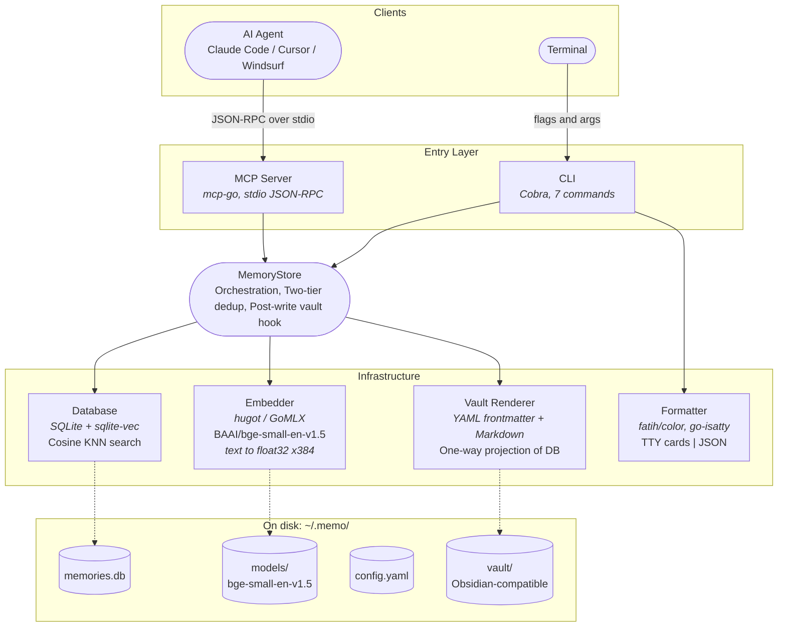

# memo

[](https://github.com/ybonda/memo/releases)
[](./LICENSE)
[](https://aigregator.com/tools/memo?utm_source=badge&utm_medium=embed&utm_campaign=featured)

Persistent memory for AI coding agents. Give Claude Code, Cursor, Codex, and other MCP-compatible tools a semantic memory that survives between sessions — all data stays on your machine.

memo runs as a local MCP server, embedding and storing memories in SQLite with vector search. Your AI agent remembers architecture decisions, bug patterns, project context, and anything else you tell it to — across every conversation.

Every memory is also rendered as a Markdown file in an Obsidian-compatible vault, so you can browse, search, and graph your memory store with the full Obsidian UI.

## Architecture



**Data flow for `remember` (the most complex operation):**

```
Content in → SHA256 hash → ID (exact dedup) → Embed text → KNN search (semantic dedup) → Insert memory + vector
                ↓ match                           ↓ cosine ≥ 0.90
            return "exists"                   return "similar_exists"
```

**Key tech choices:**

| Layer | Technology | Why |
|-------|-----------|-----|
| Embedding | [hugot](https://github.com/knights-analytics/hugot) + GoMLX | Pure Go inference — no Python, no ONNX Runtime, zero external dependencies |
| Vector search | [sqlite-vec](https://github.com/asg017/sqlite-vec) | Cosine KNN as a SQLite extension — single file, no separate vector DB |
| MCP transport | [mcp-go](https://github.com/mark3labs/mcp-go) | Stdio JSON-RPC — agent spawns memo as a child process, keeps it warm |
| CLI framework | [Cobra](https://github.com/spf13/cobra) | Standard Go CLI toolkit with subcommands and flag parsing |
| Output | [fatih/color](https://github.com/fatih/color) + [go-isatty](https://github.com/mattn/go-isatty) | Auto-detects terminal vs pipe — colored cards for humans, JSON for machines |

## Quick Start

### 1. Install

**Option 1 — Homebrew** (recommended):

```bash
brew install ybonda/tap/memo
```

**Option 2 — Install script** (if you don't use Homebrew):

```bash
curl -sSfL https://raw.githubusercontent.com/ybonda/memo/main/install.sh | sh
```

<details>
<summary>Option 3 — Other methods</summary>

**Pre-built binaries**: download from [GitHub Releases](https://github.com/ybonda/memo/releases).

**Build from source** (requires Go 1.26+ and a C compiler):

```bash
git clone https://github.com/ybonda/memo.git && cd memo && make install
```

</details>

The first run downloads the embedding model (~50MB) to `~/.memo/models/`.

### 2. Connect to your AI agent

**Claude Code** (one command, available in every project):

```bash
claude mcp add --scope user memo -- memo serve
```

**Cursor / Windsurf** (add to `.cursor/mcp.json` or equivalent):

```json
{
  "mcpServers": {
    "memo": {
      "command": "memo",
      "args": ["serve"]
    }
  }
}
```

That's it. Your agent now has persistent memory.

### 3. Use it

Once connected, your AI agent can store and retrieve memories automatically:

```
You:  "Remember that our API rate limit is 100 req/s per tenant"
       → agent calls memo_remember with type=note, tags=api,rate-limit

You:  "What do we know about rate limiting?"
       → agent calls memo_search with query="rate limiting"
       → Gets back relevant memories with similarity scores

You:  "Summarize what we've learned about our Go services"
       → agent calls memo_recall with query="Go services"
       → Gets pre-formatted context injected into its prompt
```

Memories persist across sessions. Next week, in a different project, the agent can still recall what you stored today.

## Upgrading

Existing installs upgrade cleanly: your `~/.memo/memories.db` and `~/.memo/config.yaml` are preserved, and new config fields (like `vault_path`) are backfilled with defaults on first run. No migrations, no data loss.

### 1. Update the binary

**Homebrew:**

```bash
brew update && brew upgrade memo
```

**Install script** (re-run — it downloads the latest release):

```bash
curl -sSfL https://raw.githubusercontent.com/ybonda/memo/main/install.sh | sh
```

**From source:**

```bash
cd path/to/memo && git pull && make install
```

### 2. Mirror existing memories into the vault (v0.2.0 one-time)

The auto-sync hook only fires on future writes. To mirror memories that predate the upgrade into the Obsidian vault, run a one-time full export:

```bash
memo export
```

Then open `~/.memo/vault/` in Obsidian.

If you are upgrading across the version that introduced the body formatter, `memo export` also re-renders existing files with the new structure (bolded lead-in labels, numbered lists promoted from `(1)(2)(3)` markers, backticks on hyphenated identifiers). Filenames stay stable; only bodies change.

### 3. Restart your MCP client

Claude Code, Cursor, and other MCP clients spawn `memo serve` as a long-running child process. After upgrading the binary, restart the client (or the `memo serve` process directly) so it picks up the new version.

## MCP Tools

The MCP server exposes nine tools to the agent:

| Tool | What it does |
|------|-------------|
| `memo_remember` | Store a memory (auto-detects duplicates) |
| `memo_search` | Semantic search across all memories |
| `memo_recall` | Get formatted context for LLM prompts |
| `memo_list` | List memories by recency |
| `memo_similar` | Find near-duplicates |
| `memo_update` | Update content, type, or tags |
| `memo_forget` | Delete a memory by full UUID or 8-hex short-id (Obsidian filename prefix) |
| `memo_reconcile` | Reflect Obsidian deletes and type-folder moves back into the DB |
| `memo_status` | Show counts per type, paths, vault drift, and the most recent async render error |

The server keeps the embedding model and database connection warm for the entire session — tool calls complete in milliseconds.

## Using memo with Claude Code without flooding your terminal

By default, every `mcp__memo__*` tool call inlines its raw JSON result into the chat. For list/recall calls that return dozens of memories this is loud and burns main-thread context. Wrap all memo MCP calls inside a subagent so the raw JSON stays inside the subagent's context and only a short summary reaches the main thread.

Add the following rule to your `~/.claude/CLAUDE.md` (global) or a project-level `CLAUDE.md`:

```
Memo tools: ALWAYS wrap ALL `mcp__memo__*` tool calls (search, recall, remember,
update, forget, list, similar, reconcile, status) inside an `Agent` subagent
(subagent_type: `general-purpose`). Never call these tools directly from the
main thread. The subagent must return a concise summary (<300 words): for reads,
key points + memory IDs; for writes (remember/update/forget/reconcile), just
confirm success + memory ID. Never surface raw JSON to the main thread.
Exception: if I explicitly ask to see raw memo JSON, call directly.
```

The `mcp__memo__*` glob covers every current and future memo MCP tool, so you never need to revisit this rule when new ones are added. Read operations (`search`, `recall`, `list`, `similar`, `status`) benefit most — they return the largest payloads. Write operations (`remember`, `update`, `forget`) also get wrapped for consistency; the overhead is negligible since the response is small anyway.

## Custom Memory Types

Memory types are fully configurable — define whatever categories make sense for your workflow. Types are validated at runtime; unknown types are rejected with an error listing valid options.

**Default types:**

| Type | Description |
|---|---|
| `note` | General observations, ideas, WIP thoughts (default) |
| `incident` | Production incidents, PagerDuty alerts, outages, escalations, bugs, issues |
| `ticket` | Jira tickets, DEVOPS-*, APP-*, OPS-* |
| `guides` | Guides, documentation, how-tos, best practices, Settings, configurations, gotchas |
| `architecture` | Architecture decisions, system design patterns |

**Adding or renaming types:**

Edit the `types` section in `~/.memo/config.yaml`:

```yaml
types:
  - name: note
    description: "General observations, ideas, WIP thoughts"
    default: true
  - name: incident
    description: "Production incidents, PagerDuty alerts, outages, escalations, bugs, issues"
  - name: my-custom-type
    description: "Whatever fits your workflow"
```

The first type with `default: true` is used when no type is specified. If no type has `default: true`, the first type in the list becomes the default.

> **Note:** The MCP server reads the config once at startup and registers types as a fixed enum in tool schemas. After editing `config.yaml`, restart the MCP server for changes to take effect. CLI commands pick up config changes immediately.

## Configuration

Auto-created at `~/.memo/config.yaml` on first run:

```yaml
db_path: ~/.memo/memories.db
vault_path: ~/.memo/vault
embedding:
  model: BAAI/bge-small-en-v1.5
  dimensions: 384
  cache_dir: ~/.memo/models
duplicate_threshold: 0.90

llm_md_export:
  enabled: false         # opt-in; disabled by default
  command: claude        # binary to invoke (must be on PATH)
  model: haiku           # passed as --model to `claude -p` (haiku is default — fast enough to finish within timeout; sonnet often exceeds it on large memos)
  timeout_seconds: 180   # per-render timeout (covers CLI cold start + generation on medium memos with diagram conversion)

types:
  - name: note
    description: "General observations, ideas, WIP thoughts"
    default: true
  - name: incident
    description: "Production incidents, PagerDuty alerts, outages, escalations, bugs, issues"
  - name: ticket
    description: "Jira tickets, DEVOPS-*, APP-*, OPS-*"
  - name: guides
    description: "Guides, documentation, how-tos, best practices, Settings, configurations, gotchas"
  - name: architecture
    description: "Architecture decisions, system design patterns"
```

See the [LLM-polished vault](#llm-polished-vault-optional) section for what `llm_md_export` does.

## CLI

memo also works as a standalone CLI tool. Output adapts automatically: colored cards in a terminal, JSON when piped or with `--json`.

```bash
# Store a few memories
memo remember --content "Go uses goroutines and channels for concurrency" --type note --tags "go,concurrency,channels"
memo remember --content "Always validate user input at API boundaries" --type ticket --tags "security,api"

# Semantic search — finds relevant memories even with different wording
memo search --query "parallel programming in Go"

# List everything
memo list

# Get formatted context you can paste into an LLM prompt
memo recall --query "database scaling"

# Find near-duplicates before storing
memo similar --content "Go channels enable CSP-style concurrency"

# Update or remove
memo update --id 31940748-a1b2-c3d4-e5f6-119922334455 --tags "go,concurrency,channels,goroutines"
memo forget --id 80035334-f6e5-d4c3-b2a1-554433221100

# forget also accepts the 8-hex short-id you see on Obsidian filenames
memo forget --id 80035334

# Rebuild the Obsidian vault from the DB (first-time setup or after pointing vault_path elsewhere)
memo export

# Preview what would change without touching the filesystem
memo export --dry-run

# Regenerate frozen slugs from current content (rare; after heavy content rewrites)
memo export --rename

# Preview deletes and type-folder moves made inside Obsidian
memo reconcile

# Apply them to the DB
memo reconcile --apply

# Snapshot of inventory, paths, vault drift, and the last async render error
memo status
```

Terminal output renders as colored cards with relative timestamps:

```
[note] Go uses goroutines and channels for concurrency
  tags: go, concurrency, channels  ·  updated: 1d ago  ·  id: 31940748-a1b2-c3d4-e5f6-119922334455

[ticket] Always validate user input at API boundaries
  tags: security, api  ·  updated: 1d ago  ·  id: 428cee7e-9f8a-7b6c-5d4e-aabbccddeeff
```

### CLI Reference

| Command | Flags | Notes |
|---------|-------|-------|
| `memo remember` | `--content` (required), `--type`, `--tags` | Auto-dedup: returns `"exists"` (exact hash) or `"similar_exists"` (cosine >= 0.90) |
| `memo search` | `--query` (required), `--type`, `--limit` | Ranked by cosine similarity (0.0-1.0) |
| `memo list` | `--type`, `--limit` | Ordered by most recently updated |
| `memo recall` | `--query` (required), `--limit` | Returns pre-formatted `context` string + raw memory data |
| `memo similar` | `--content` (required) | Returns 5 most similar memories with scores |
| `memo update` | `--id` (required), `--content`, `--type`, `--tags` | Only provided fields change; re-embeds on content change |
| `memo forget` | `--id` (required) | Permanent delete. `--id` accepts full UUID or 8-hex short-id prefix |
| `memo export` | `--rename`, `--dry-run` | Full rebuild of the Obsidian vault from the DB; prunes orphans. Normal writes auto-sync without this command |
| `memo reconcile` | `--apply` | Applies Obsidian-side deletes and type-folder moves to the DB. Dry-run by default |
| `memo status` | | Snapshot of inventory (counts per type), paths, file sizes, vault drift, embedding + LLM render config, and the most recent async render error |
| `memo serve` | | Starts MCP server over stdio |

## Obsidian Vault

Every memory is mirrored to a Markdown file under `~/.memo/vault/` (configurable via `vault_path`). Point Obsidian at that folder and you get the full Obsidian UI (graph view, full-text search, tag browsing, mobile sync) over your memory store.

**Layout:**

```
~/.memo/vault/
├── note/
│   ├── 31940748-go-uses-goroutines-and-channels.md
│   └── 492dd345-memory-one-about-caching.md
├── bug/
│   └── 038bf12e-memory-two-about-retries.md
└── architecture/
    └── 931cdde9-memory-three-about-metrics.md
```

Folders mirror memory types. Filenames are `<short-id>-<slug>.md` where `<short-id>` is the first 8 hex chars of the UUID and `<slug>` is a slugified snippet of the content. The filename is **frozen** at first write so Obsidian wikilinks remain stable across content edits.

**File shape** (YAML frontmatter + body):

```markdown
---
id: 29dd4bab-221a-1ba5-db14-1a420c53e2bf
title: First memo about SQLite
type: note
tags:
  - db
  - sqlite
created: "2026-04-19T14:59:55Z"
updated: "2026-04-19T14:59:55Z"
---

First memo about SQLite
```

Obsidian's Properties UI recognizes `tags`, `created`, and `updated` natively. Use `title` as the display column in your file browser.

**Sync semantics:** the DB is the source of truth for *memory content*. Every `remember` / `update` / `forget` (CLI or MCP) syncs the affected `.md` file automatically, and manual edits to a file's *body* are silently overwritten on the next sync. To change a memory's content, use `memo update` (or ask your agent to).

Two structural changes you can make inside Obsidian are applied back to the DB when you explicitly ask for it: **deleting a file** removes the memory, and **moving a file to a different type folder** changes the memory's type. Run `memo reconcile` to preview and `memo reconcile --apply` to commit. Body edits are still ignored by reconcile.

**Body formatting:** when `memo` writes a file, it runs the content through a small deterministic formatter that bolds ALL-CAPS lead-in labels (`KEY LESSON:`, `ROOT CAUSE:`), promotes inline `(1)(2)(3)` enumerations into real numbered lists, splits long paragraphs at sentence boundaries, and wraps hyphenated identifiers like `jobs-guideevents` in backticks. The raw content stored in the DB is untouched, so embeddings and IDs are unaffected. If you already write markdown (blank lines, lists, bold, or fenced code), the formatter leaves your text exactly as-is.

### LLM-polished vault (optional)

If you have the `claude` CLI installed and want richer Obsidian markdown (Obsidian `> [!info]` / `> [!warning]` callouts, wikilinked ticket IDs on first occurrence, promoted headings), enable the LLM polish in `~/.memo/config.yaml`:

```yaml
llm_md_export:
  enabled: true
  command: claude
  model: haiku
  timeout_seconds: 60
```

The feature uses your Claude Code subscription (no API key, no per-token billing — `claude -p` is invoked as a subprocess). A strict system prompt tells the model to restructure only, never paraphrase or drop content, so the polished body stays a faithful projection of what you stored.

**Model choice:** Haiku is the default because the task is purely structural (restructure markdown, never add/paraphrase content) and the async flow rewards fast models. Haiku 4.5 finishes a ~16 KB memo in ~15-25s. Sonnet takes 60-120s for the same input and routinely exceeds the 60s timeout — the render gets discarded and the deterministic body stays in the vault. Switch to `sonnet` only if you find Haiku's callout/heading placement noticeably off.

**How it runs:** the LLM pass is **asynchronous**. Every `memo_remember` / `memo_update` / `memo remember` / `memo update`:

1. Writes the memory to the DB and syncs the `.md` file with the deterministic formatter — this completes in milliseconds and returns immediately.
2. Schedules the LLM render in a background goroutine that overwrites the `.md` with the polished version when it finishes (~60-120s for a long memo).

So the vault is always usable — Obsidian sees the deterministic version first, the polished version replaces it moments later. Claude Code (MCP) never waits on the render.

**Trade-offs to know:**

- Short-lived CLI processes (`memo remember "foo"`) wait for the render at `Close()` because the goroutine would otherwise be killed when the command exits. If you want fire-and-forget writes from the CLI, prefer the MCP server.
- If you disable `llm_md_export` after using it, existing `.md` files keep their polished body until the next `memo update` or `memo export --rename`. The DB still stores the deterministic content as the source of truth.
- `memo reformat <id>` (available when `llm_md_export.enabled: true`) re-runs the LLM render on a single memory synchronously. Useful when you want to re-polish one memory without waiting for the async path.
- Render failures (timeout, claude CLI offline) are silent: the deterministic body stays in the vault, stderr logs `[memo] async llm render failed for <id>: ...`, and the DB is untouched.

**When to run `memo export` manually:**

- First-time setup, if `~/.memo/vault/` was deleted or moved
- After changing `vault_path` to a new location
- To prune orphan `.md` files left behind by a failed hook (rare; iCloud offline, permission error)
- With `--rename` after heavy content rewrites, to refresh stale slugs

User-authored `.md` files in the vault (any filename that doesn't start with an 8-hex short-id) are left untouched by `memo export` and `memo reconcile`, so you can add your own notes alongside the generated ones.

**Instant delete from Obsidian (optional):** if you want Obsidian-triggered deletes to propagate immediately without running `memo reconcile`, install the [Shell Commands](https://github.com/Taitava/obsidian-shellcommands) community plugin and add one command:

| Field | Value |
|---|---|
| Event | On file deleted |
| Shell command | `memo forget --id {{file_name:no_extension}}` |

`memo forget` accepts the 8-hex short-id prefix, so any Obsidian filename works directly.

## Design

| Decision | Rationale |
|---|---|
| Local MCP server over stdio | Single warm process — no per-call model load or DB open overhead |
| Pure Go embeddings (GoMLX) | No ONNX Runtime install required, zero external dependencies |
| sqlite-vec cosine distance | Proper 0-1 similarity scores for semantic search |
| SHA256 content-hashed IDs | Deterministic — same content always gets same ID, enabling dedup |
| Config-driven types | Extensible without recompilation, strict validation |
| Dual output (TTY cards / JSON) | Human-friendly in terminal, machine-parseable when piped |
| Vault is a one-way projection of the DB | Avoids conflict resolution; content-addressed IDs stay sound; users get Obsidian's UI without a two-sync-engine complexity |
| LLM polish runs asynchronously | `memo_remember` / `memo_update` return in milliseconds; the optional `claude -p` pass runs in a background goroutine and upgrades the vault `.md` when ready — keeping Claude Code unblocked on long-form writes like incident memos |
