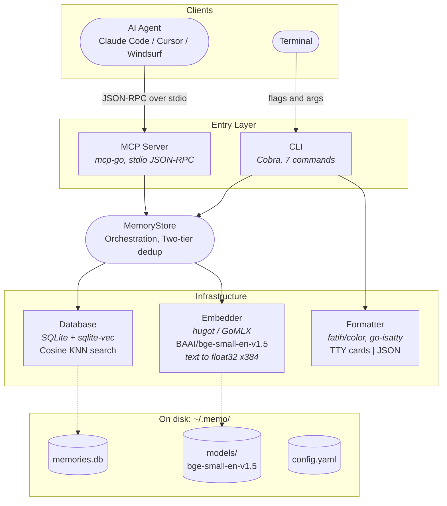

# memo

Persistent memory for AI coding agents. Give Claude Code, Cursor, Windsurf, and other MCP-compatible tools a semantic memory that survives between sessions — all data stays on your machine.

memo runs as a local MCP server, embedding and storing memories in SQLite with vector search. Your AI agent remembers architecture decisions, bug patterns, project context, and anything else you tell it to — across every conversation.

## Architecture



**Data flow for `remember` (the most complex operation):**

```
Content in → SHA256 hash → ID (exact dedup) → Embed text → KNN search (semantic dedup) → Insert memory + vector
                ↓ match                           ↓ cosine ≥ 0.90
            return "exists"                   return "similar_exists"
```

**Key tech choices:**

| Layer | Technology | Why |
|-------|-----------|-----|
| Embedding | [hugot](https://github.com/knights-analytics/hugot) + GoMLX | Pure Go inference — no Python, no ONNX Runtime, zero external dependencies |
| Vector search | [sqlite-vec](https://github.com/asg017/sqlite-vec) | Cosine KNN as a SQLite extension — single file, no separate vector DB |
| MCP transport | [mcp-go](https://github.com/mark3labs/mcp-go) | Stdio JSON-RPC — agent spawns memo as a child process, keeps it warm |
| CLI framework | [Cobra](https://github.com/spf13/cobra) | Standard Go CLI toolkit with subcommands and flag parsing |
| Output | [fatih/color](https://github.com/fatih/color) + [go-isatty](https://github.com/mattn/go-isatty) | Auto-detects terminal vs pipe — colored cards for humans, JSON for machines |

## Quick Start

### 1. Install

Requires Go 1.26+ and a C compiler (CGO is needed for sqlite-vec).

```bash
make install
```

The first run downloads the embedding model (~50MB) to `~/.memo/models/`.

### 2. Connect to your AI agent

**Claude Code** (one command, available in every project):

```bash
claude mcp add --scope user memo -- memo serve
```

**Cursor / Windsurf** (add to `.cursor/mcp.json` or equivalent):

```json
{
  "mcpServers": {
    "memo": {
      "command": "memo",
      "args": ["serve"]
    }
  }
}
```

That's it. Your agent now has persistent memory.

### 3. Use it

Once connected, your AI agent can store and retrieve memories automatically:

```
You:  "Remember that our API rate limit is 100 req/s per tenant"
       → agent calls memo_remember with type=note, tags=api,rate-limit

You:  "What do we know about rate limiting?"
       → agent calls memo_search with query="rate limiting"
       → Gets back relevant memories with similarity scores

You:  "Summarize what we've learned about our Go services"
       → agent calls memo_recall with query="Go services"
       → Gets pre-formatted context injected into its prompt
```

Memories persist across sessions. Next week, in a different project, the agent can still recall what you stored today.

## MCP Tools

The MCP server exposes seven tools to the agent:

| Tool | What it does |
|------|-------------|
| `memo_remember` | Store a memory (auto-detects duplicates) |
| `memo_search` | Semantic search across all memories |
| `memo_recall` | Get formatted context for LLM prompts |
| `memo_list` | List memories by recency |
| `memo_similar` | Find near-duplicates |
| `memo_update` | Update content, type, or tags |
| `memo_forget` | Delete a memory by ID |

The server keeps the embedding model and database connection warm for the entire session — tool calls complete in milliseconds.

## Custom Memory Types

Memory types are fully configurable — define whatever categories make sense for your workflow. Types are validated at runtime; unknown types are rejected with an error listing valid options.

**Default types:**

| Type | Description |
|---|---|
| `note` | General observations, ideas, WIP thoughts (default) |
| `bug` | Bug reports, error patterns, known issues |
| `incident` | Production incidents, outages, escalations |
| `architecture` | Architecture decisions, system design patterns |
| `ticket` | Tickets, tasks, action items, follow-ups |
| `postmortem` | Post-incident analysis, root causes, remediation steps |

**Adding or renaming types:**

Edit the `types` section in `~/.memo/config.yaml`:

```yaml
types:
  - name: note
    description: "General observations, ideas, WIP thoughts"
    default: true
  - name: bug
    description: "Bug reports, error patterns, known issues"
  - name: my-custom-type
    description: "Whatever fits your workflow"
```

The first type with `default: true` is used when no type is specified. If no type has `default: true`, the first type in the list becomes the default.

> **Note:** The MCP server reads the config once at startup and registers types as a fixed enum in tool schemas. After editing `config.yaml`, restart the MCP server for changes to take effect. CLI commands pick up config changes immediately.

## Configuration

Auto-created at `~/.memo/config.yaml` on first run:

```yaml
db_path: ~/.memo/memories.db
embedding:
  model: BAAI/bge-small-en-v1.5
  dimensions: 384
  cache_dir: ~/.memo/models
duplicate_threshold: 0.90

types:
  - name: note
    description: "General observations, ideas, WIP thoughts"
    default: true
  - name: bug
    description: "Bug reports, error patterns, known issues"
  - name: incident
    description: "Production incidents, outages, escalations"
  - name: architecture
    description: "Architecture decisions, system design patterns"
  - name: ticket
    description: "Tickets, tasks, action items, follow-ups"
  - name: postmortem
    description: "Post-incident analysis, root causes, remediation steps"
```

## CLI

memo also works as a standalone CLI tool. Output adapts automatically: colored cards in a terminal, JSON when piped or with `--json`.

```bash
# Store a few memories
memo remember --content "Go uses goroutines and channels for concurrency" --type note --tags "go,concurrency,channels"
memo remember --content "Always validate user input at API boundaries" --type ticket --tags "security,api"

# Semantic search — finds relevant memories even with different wording
memo search --query "parallel programming in Go"

# List everything
memo list

# Get formatted context you can paste into an LLM prompt
memo recall --query "database scaling"

# Find near-duplicates before storing
memo similar --content "Go channels enable CSP-style concurrency"

# Update or remove
memo update --id 31940748 --tags "go,concurrency,channels,goroutines"
memo forget --id 80035334
```

Terminal output renders as colored cards with relative timestamps:

```
[note] Go uses goroutines and channels for concurrency
  tags: go, concurrency, channels  ·  updated: 1d ago  ·  id: 31940748

[ticket] Always validate user input at API boundaries
  tags: security, api  ·  updated: 1d ago  ·  id: 428cee7e
```

### CLI Reference

| Command | Flags | Notes |
|---------|-------|-------|
| `memo remember` | `--content` (required), `--type`, `--tags` | Auto-dedup: returns `"exists"` (exact hash) or `"similar_exists"` (cosine >= 0.90) |
| `memo search` | `--query` (required), `--type`, `--limit` | Ranked by cosine similarity (0.0-1.0) |
| `memo list` | `--type`, `--limit` | Ordered by most recently updated |
| `memo recall` | `--query` (required), `--limit` | Returns pre-formatted `context` string + raw memory data |
| `memo similar` | `--content` (required) | Returns 5 most similar memories with scores |
| `memo update` | `--id` (required), `--content`, `--type`, `--tags` | Only provided fields change; re-embeds on content change |
| `memo forget` | `--id` (required) | Permanent delete |
| `memo serve` | | Starts MCP server over stdio |

## Design

| Decision | Rationale |
|---|---|
| Local MCP server over stdio | Single warm process — no per-call model load or DB open overhead |
| Pure Go embeddings (GoMLX) | No ONNX Runtime install required, zero external dependencies |
| sqlite-vec cosine distance | Proper 0-1 similarity scores for semantic search |
| SHA256 content-hashed IDs | Deterministic — same content always gets same ID, enabling dedup |
| Config-driven types | Extensible without recompilation, strict validation |
| Dual output (TTY cards / JSON) | Human-friendly in terminal, machine-parseable when piped |
